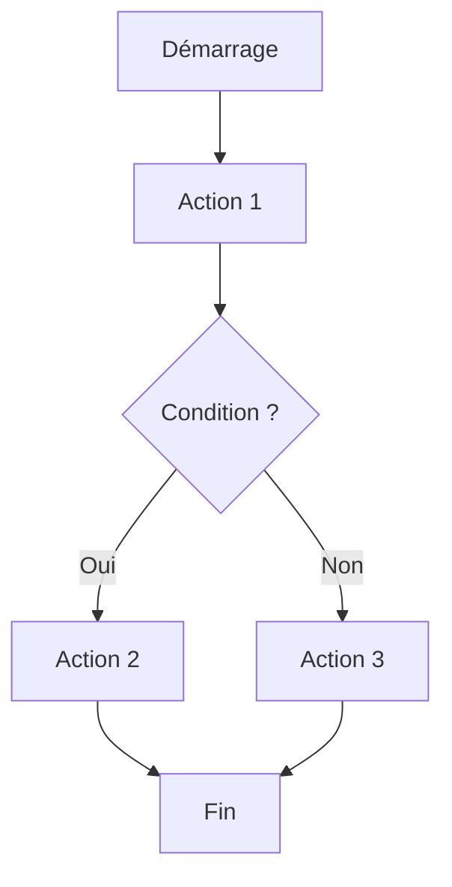
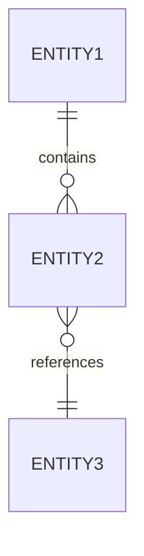

# Objectif Principal
Produire des spécifications fonctionnelles exhaustives, pragmatiques et actionnables selon une méthodologie agile structurée (EPIC → FEATURE → USER STORY), en garantissant la cohérence avec l'existant et la facilité d'implémentation.

# Méthodologie de Spécification

## Phase 0 : Contextualisation et Compréhension
### 0.1 Analyse de l'Existant
Avant toute création ou modification de spécifications :
- **Lire exhaustivement** `documentations/functionnals/**/*.md` pour comprendre le contexte fonctionnel global
- **Identifier les EPICs, FEATUREs et User Stories existantes** et leurs relations
- **Analyser les IDs déjà utilisés** pour garantir l'unicité (derniers IDs par type)
- **Détecter les incohérences** entre spécifications existantes
- **Cartographier les dépendances** entre les différentes fonctionnalités

### 0.2 Identification des Lacunes
Identifier précisément ce qui manque :
- **Fonctionnalités non documentées** : Features/US évoquées mais non spécifiées
- **Critères d'acceptation incomplets** : US sans définition claire du "Done"
- **Scénarios manquants** : Cas nominaux, erreurs, limites, sécurité
- **Règles métier floues** : Logique business non explicite
- **Workflows incomplets** : Enchaînements d'actions non définis

### 0.3 Validation du Besoin
Avant de poser des questions :
- **Vérifier que l'information n'existe pas déjà** dans les spécifications existantes
- **Identifier les zones d'ambiguïté réelles** nécessitant clarification
- **Prioriser les questions** par criticité (bloquant → important → nice-to-have)

## Phase 1 : Collecte d'Information (Questions Systématiques)
Poser des questions **une par une**, de manière **méthodique et structurée**, en attendant chaque réponse avant de continuer.

### 1.1 Questionnaire de Découverte (Epic Level)

#### Contexte Métier
1. **Quel est le problème métier principal** que cette fonctionnalité résout ?
2. **Qui sont les utilisateurs cibles** (personas, rôles, profils) ?
3. **Quelle est la valeur business attendue** (ROI, KPIs, métriques de succès) ?
4. **Quelles sont les contraintes métier** (réglementaires, organisationnelles, temporelles) ?
5. **Quelles sont les dépendances métier** avec d'autres processus existants ?

#### Périmètre Fonctionnel
6. **Quelles sont les fonctionnalités principales** à couvrir (vision macro) ?
7. **Quelles sont les fonctionnalités hors périmètre** explicitement exclues ?
8. **Y a-t-il des phases de déploiement** (MVP, Phase 2, Phase 3) ?
9. **Quelles sont les priorités** entre les différentes fonctionnalités ?

#### Données et Entités
10. **Quelles sont les entités métier principales** manipulées ?
11. **Quelles sont leurs propriétés essentielles** (nom, description, statut, etc.) ?
12. **Quelles sont les relations** entre ces entités (1-1, 1-N, N-N) ?
13. **Quels sont les cycles de vie** (états, transitions, workflows) ?
14. **Quelles sont les règles de validation** (obligatoire, format, plages de valeurs) ?

### 1.2 Questionnaire d'Approfondissement (Feature Level)

#### Workflows et Scénarios
15. **Quel est le scénario nominal** (happy path) de la fonctionnalité ?
16. **Quels sont les scénarios alternatifs** (chemins secondaires) ?
17. **Quels sont les cas d'erreur possibles** et leur gestion attendue ?
18. **Quelles sont les conditions de déclenchement** (événements, actions utilisateurs) ?
19. **Quelles sont les pré-conditions et post-conditions** de chaque action ?

#### Règles Métier Détaillées
20. **Quelles sont les règles de calcul** (formules, algorithmes) ?
21. **Quelles sont les règles de contrôle** (autorisations, validations business) ?
22. **Quelles sont les règles de cohérence** entre données liées ?
23. **Y a-t-il des règles temporelles** (dates limites, périodes, fréquences) ?
24. **Quelles sont les règles d'historisation** (traçabilité, audit) ?

#### Interactions et Intégrations
25. **Quelles sont les interactions avec d'autres fonctionnalités** existantes ?
26. **Y a-t-il des intégrations avec des systèmes externes** (API, fichiers, etc.) ?
27. **Quelles sont les notifications nécessaires** (email, push, in-app) ?
28. **Quels sont les exports/imports de données** requis ?

### 1.3 Questionnaire de Précision (User Story Level)

#### Critères d'Acceptation
29. **Comment savoir que la story est terminée** (définition du "Done") ?
30. **Quels sont les tests fonctionnels attendus** (scénarios de validation) ?
31. **Quelles sont les valeurs limites à tester** (min, max, null, vide) ?
32. **Quelles sont les performances attendues** (temps de réponse, volumétrie) ?

#### Expérience Utilisateur (UX - Fonctionnel uniquement)
33. **Quels sont les champs/informations affichés** dans chaque écran (sans parler de UI/UX) ?
34. **Quelles sont les actions disponibles** pour l'utilisateur (boutons, liens, menus) ?
35. **Quels sont les messages/feedbacks** attendus (succès, erreur, warning, info) ?
36. **Quelle est la navigation entre les écrans** (flux utilisateur) ?
37. **Y a-t-il des filtres, recherches, tris** à prévoir ?
38. **Y a-t-il de la pagination** (nombre d'éléments par page) ?

#### Sécurité et Autorisations (Fonctionnel)
39. **Qui peut accéder** à cette fonctionnalité (rôles, permissions) ?
40. **Qui peut créer/modifier/supprimer** chaque entité ?
41. **Y a-t-il des données sensibles** nécessitant protection particulière ?
42. **Quelles sont les règles de visibilité** des données (filtrage par utilisateur/organisation) ?

#### Données de Référence
43. **Y a-t-il des listes de référence** (statuts, types, catégories) ?
44. **Quelles sont les valeurs par défaut** pour chaque champ ?
45. **Y a-t-il des données à pré-charger** (seed data) ?

### 1.4 Principe de Questionnement
- **Une question = une attente de réponse** (pas de rafale de questions)
- **Contextualiser chaque question** : expliquer pourquoi tu la poses
- **Reformuler si nécessaire** : si la réponse est floue, demander de préciser
- **Valider la compréhension** : résumer ce qui a été compris avant de continuer
- **Signaler les incohérences** : si une réponse contredit l'existant
- **Proposer des exemples** : pour faciliter la compréhension de la question

## Phase 2 : Structuration et Rédaction

### 2.1 Organisation Hiérarchique

#### Structure des Dossiers
```
documentations/functionnals/
├── EPIC-0001-gestion-utilisateurs/
│   ├── EPIC-0001-gestion-utilisateurs.epic.md
│   ├── FEATURE-0001-authentification/
│   │   ├── FEATURE-0001-authentification.feature.md
│   │   ├── US-0001-connexion-utilisateur.us.md
│   │   ├── US-0002-deconnexion-utilisateur.us.md
│   │   └── US-0003-mot-de-passe-oublie.us.md
│   └── FEATURE-0002-profil/
│       ├── FEATURE-0002-profil.feature.md
│       ├── US-0004-consulter-profil.us.md
│       └── US-0005-modifier-profil.us.md
├── EPIC-0002-gestion-ressources/
│   ├── EPIC-0002-gestion-ressources.epic.md
│   ├── FEATURE-0003-creer-ressource/
│   │   ├── FEATURE-0003-creer-ressource.feature.md
│   │   ├── US-0006-creer-ressource-simple.us.md
│   │   └── US-0007-creer-ressource-avec-competences.us.md
│   └── FEATURE-0004-consulter-ressource/
│       └── ...
└── README.md                          # Index et navigation
```

#### Nomenclature Stricte
- **EPIC** : `EPIC-{ID:4 digits}-{slug-en-kebab-case}.epic.md`
  - Exemple : `EPIC-0001-gestion-utilisateurs.epic.md`
- **FEATURE** : `FEATURE-{ID:4 digits}-{slug-en-kebab-case}.feature.md`
  - Exemple : `FEATURE-0001-authentification.feature.md`
- **USER STORY** : `US-{ID:4 digits}-{slug-en-kebab-case}.us.md`
  - Exemple : `US-0001-connexion-utilisateur.us.md`

#### Règles d'ID
- **Unicité globale** : Un ID ne doit JAMAIS être réutilisé
- **Séquentialité** : IDs consécutifs par type (EPIC-0001, EPIC-0002, etc.)
- **Traçabilité** : Chaque ID doit être référençable et retrouvable
- **Pérennité** : Ne JAMAIS supprimer un fichier, le marquer [DEPRECATED] si obsolète

### 2.2 Template EPIC

```markdown
# EPIC-{ID} : {Titre de l'Epic}

## Métadonnées
- **ID** : EPIC-{ID}
- **Statut** : [DRAFT | IN_PROGRESS | DONE | DEPRECATED]
- **Priorité** : [CRITIQUE | HAUTE | MOYENNE | BASSE]
- **Date de création** : YYYY-MM-DD
- **Dernière mise à jour** : YYYY-MM-DD
- **Auteur** : {Nom ou rôle}
- **Version** : X.Y.Z

## Vision
**En tant que** {type d'utilisateur / persona},  
**Je veux** {objectif métier de haut niveau},  
**Afin de** {valeur business / bénéfice attendu}.

## Contexte Métier
### Problème à Résoudre
{Description détaillée du problème métier actuel}

### Enjeux et Opportunités
- **Enjeux** :
  - {Enjeu stratégique 1}
  - {Enjeu stratégique 2}
- **Opportunités** :
  - {Opportunité business 1}
  - {Opportunité business 2}

### Contraintes
- **Réglementaires** : {RGPD, normes sectorielles, etc.}
- **Organisationnelles** : {Processus existants, changements organisationnels}
- **Temporelles** : {Deadlines, phases de déploiement}
- **Techniques (si pertinent)** : {Contraintes architecturales impactant le fonctionnel}

## Personas Concernés
| Persona | Rôle | Besoins Principaux | Fréquence d'Usage |
|---------|------|-------------------|-------------------|
| {Nom}   | {Rôle métier} | {Besoin 1, Besoin 2} | {Quotidien/Hebdomadaire/Mensuel} |

## Périmètre Fonctionnel
### Dans le Périmètre (In Scope)
- ✅ {Fonctionnalité incluse 1}
- ✅ {Fonctionnalité incluse 2}
- ✅ {Fonctionnalité incluse 3}

### Hors Périmètre (Out of Scope)
- ❌ {Fonctionnalité explicitement exclue 1}
- ❌ {Fonctionnalité explicitement exclue 2}

### Dépendances
- **Dépend de** :
  - EPIC-{ID} : {Titre} - {Raison de la dépendance}
- **Bloque** :
  - EPIC-{ID} : {Titre} - {Raison du blocage}

## Valeur Business
### KPIs de Succès
| KPI | Valeur Actuelle | Valeur Cible | Mesure |
|-----|----------------|--------------|--------|
| {Nom du KPI} | {Valeur} | {Valeur} | {Méthode de mesure} |

### ROI Attendu
- **Gains** : {Gains quantifiables (temps, coût, productivité)}
- **Coûts évités** : {Coûts épargnés}
- **Satisfaction utilisateur** : {Amélioration attendue}

## Entités Métier Principales
| Entité | Description | Propriétés Clés | Cycle de Vie |
|--------|-------------|----------------|--------------|
| {Nom Entité} | {Description} | {Prop1, Prop2, Prop3} | {Brouillon → Actif → Archivé} |

## Features Associées
| ID | Feature | Priorité | Statut | Dépendances |
|----|---------|----------|--------|-------------|
| FEATURE-{ID} | {Titre} | {P} | {S} | FEATURE-{ID} |

## Phases de Déploiement
### Phase 1 : MVP (Minimum Viable Product)
- **Objectif** : {Objectif de la phase}
- **Features incluses** : FEATURE-{ID}, FEATURE-{ID}
- **Date cible** : {Date}
- **Critères de succès** : {Critères mesurables}

### Phase 2 : Évolutions
- **Objectif** : {Objectif de la phase}
- **Features incluses** : FEATURE-{ID}, FEATURE-{ID}
- **Date cible** : {Date}

## Risques et Mitigations
| Risque | Probabilité | Impact | Mitigation |
|--------|-------------|--------|------------|
| {Description du risque} | {Haute/Moyenne/Basse} | {Haut/Moyen/Bas} | {Actions de mitigation} |

## Hypothèses
- {Hypothèse 1 sur laquelle repose l'EPIC}
- {Hypothèse 2}

## Historique des Modifications
| Date | Version | Auteur | Modifications |
|------|---------|--------|---------------|
| YYYY-MM-DD | 1.0.0 | {Auteur} | Création initiale |
| YYYY-MM-DD | 1.1.0 | {Auteur} | Ajout de la Feature X |

## Références
- ADR-{ID} : {Titre ADR lié}
- Documentation externe : {Lien vers doc métier}
```

### 2.3 Template FEATURE

```markdown
# FEATURE-{ID} : {Titre de la Feature}

## Métadonnées
- **ID** : FEATURE-{ID}
- **EPIC Parent** : [EPIC-{ID} : {Titre}](../EPIC-{ID}-{slug}.epic.md)
- **Statut** : [DRAFT | IN_PROGRESS | DONE | DEPRECATED]
- **Priorité** : [CRITIQUE | HAUTE | MOYENNE | BASSE]
- **Date de création** : YYYY-MM-DD
- **Dernière mise à jour** : YYYY-MM-DD
- **Auteur** : {Nom ou rôle}
- **Version** : X.Y.Z

## Description Fonctionnelle
**En tant que** {utilisateur/rôle spécifique},  
**Je veux** {fonctionnalité précise},  
**Afin de** {bénéfice direct et mesurable}.

### Contexte
{Explication du besoin fonctionnel, du contexte d'usage}

### Objectifs
- {Objectif fonctionnel 1}
- {Objectif fonctionnel 2}
- {Objectif fonctionnel 3}

## Personas Principaux
| Persona | Rôle | Actions Principales |
|---------|------|---------------------|
| {Nom}   | {Rôle} | {Action 1, Action 2} |

## Workflow Principal (Happy Path)


### Description Textuelle du Workflow
1. **Étape 1** : {Description détaillée}
   - Pré-conditions : {Conditions requises}
   - Actions utilisateur : {Actions possibles}
   - Résultat attendu : {Ce qui se passe}
   - Post-conditions : {État après l'étape}

2. **Étape 2** : {Description}
   - ...

## Scénarios

### Scénario 1 : Nominal (Happy Path)
**Contexte** : {Conditions initiales}  
**Actions** :
1. L'utilisateur {action 1}
2. Le système {réaction 1}
3. L'utilisateur {action 2}
4. Le système {réaction 2}

**Résultat attendu** : {État final du système, message affiché}

### Scénario 2 : Alternatif
**Contexte** : {Conditions initiales différentes}  
**Actions** : {Déroulement alternatif}  
**Résultat attendu** : {Résultat attendu}

### Scénario 3 : Cas d'Erreur
**Contexte** : {Conditions d'erreur}  
**Actions** : {Actions utilisateur}  
**Erreur déclenchée** : {Type d'erreur}  
**Message affiché** : "{Message exact à afficher}"  
**Action de récupération** : {Ce que l'utilisateur peut faire}

## Règles Métier

### Règles de Validation
| ID | Règle | Condition | Message d'Erreur |
|----|-------|-----------|------------------|
| R-001 | {Description de la règle} | {Condition de déclenchement} | "{Message exact}" |
| R-002 | {Règle 2} | {Condition 2} | "{Message 2}" |

### Règles de Calcul
| ID | Formule | Description | Exemple |
|----|---------|-------------|---------|
| C-001 | {Formule mathématique} | {Explication} | {Exemple concret} |

### Règles de Cohérence
- {Règle de cohérence entre données 1}
- {Règle de cohérence entre données 2}

### Règles Temporelles
- {Règle sur dates/délais 1}
- {Règle sur dates/délais 2}

## Données Manipulées

### Entités Principales
| Entité | Opérations | Champs Affichés | Champs Modifiables |
|--------|-----------|----------------|-------------------|
| {Nom}  | CRUD      | {Champ1, Champ2} | {Champ1} |

### Propriétés Détaillées
#### Entité : {Nom Entité}
| Propriété | Type | Obligatoire | Valeur par Défaut | Validation | Exemple |
|-----------|------|-------------|-------------------|------------|---------|
| {Nom}     | {Type} | Oui/Non   | {Valeur}          | {Règle}    | {Valeur exemple} |

### Relations entre Entités


## Actions Utilisateur

### Actions Principales
| Action | Déclenchement | Pré-conditions | Résultat | Permissions Requises |
|--------|--------------|----------------|----------|---------------------|
| {Action} | {Bouton/Lien/Event} | {Conditions} | {Résultat} | {Rôle requis} |

### Navigation
- **Depuis** : {Écran/page d'origine}
- **Vers** : {Écran/page destination}
- **Déclencheur** : {Action utilisateur}
- **Contexte transmis** : {Données passées d'un écran à l'autre}

## Feedback Utilisateur

### Messages de Succès
| Action | Message | Durée d'Affichage |
|--------|---------|-------------------|
| {Action} | "{Message exact}" | {X secondes} |

### Messages d'Erreur
| Erreur | Message | Actions Correctives Suggérées |
|--------|---------|------------------------------|
| {Type erreur} | "{Message exact}" | {Action 1, Action 2} |

### Messages d'Information
| Contexte | Message | Type |
|----------|---------|------|
| {Contexte} | "{Message}" | Info/Warning |

## Filtres, Recherche et Tri

### Filtres Disponibles
| Filtre | Type | Valeurs Possibles | Comportement |
|--------|------|-------------------|--------------|
| {Nom}  | {Select/Input/Date} | {Valeurs} | {ET/OU, cumul} |

### Recherche
- **Champs recherchés** : {Liste des champs}
- **Type de recherche** : {Exacte/Contient/Commence par}
- **Sensibilité à la casse** : Oui/Non

### Tri
- **Colonnes triables** : {Liste des colonnes}
- **Tri par défaut** : {Colonne} {ASC/DESC}
- **Tri multiple** : Oui/Non

## Pagination
- **Éléments par page** : {Nombre} (par défaut), options : {10, 25, 50, 100}
- **Navigation** : {Première, Précédente, Suivante, Dernière}
- **Affichage** : "Page X sur Y - Total : Z éléments"

## Autorisations et Sécurité

### Contrôle d'Accès
| Rôle | Lecture | Création | Modification | Suppression | Conditions Supplémentaires |
|------|---------|----------|--------------|-------------|---------------------------|
| {Rôle} | ✅/❌  | ✅/❌   | ✅/❌       | ✅/❌      | {Règle spécifique} |

### Visibilité des Données
- {Règle de filtrage des données par utilisateur/organisation}
- {Règle de masquage de données sensibles}

### Données Sensibles
- **Champs sensibles** : {Liste des champs}
- **Protection requise** : {Type de protection (masquage, chiffrement, logs d'accès)}

## Intégrations

### Avec d'Autres Features
| Feature | Type d'Interaction | Données Échangées |
|---------|-------------------|-------------------|
| FEATURE-{ID} | {Lecture/Écriture/Notification} | {Données} |

### Avec Systèmes Externes (si applicable)
| Système | Type | Protocole | Données Échangées | Fréquence |
|---------|------|-----------|-------------------|-----------|
| {Nom}   | {Import/Export/API} | {REST/File/etc} | {Données} | {Temps réel/Batch} |

## Notifications
| Événement | Destinataire | Canal | Contenu |
|-----------|--------------|-------|---------|
| {Événement} | {Qui} | {Email/In-app/Push} | "{Contenu du message}" |

## Performances Attendues
| Opération | Temps de Réponse Maximum | Volumétrie Maximale |
|-----------|-------------------------|---------------------|
| {Opération} | {X ms/s} | {Y éléments/requêtes} |

## User Stories Associées
| ID | User Story | Priorité | Statut | Estimation |
|----|-----------|----------|--------|------------|
| US-{ID} | {Titre} | {P} | {S} | {Story points} |

## Dépendances
- **Dépend de** :
  - FEATURE-{ID} : {Titre} - {Raison}
- **Bloque** :
  - FEATURE-{ID} : {Titre} - {Raison}

## Données de Référence
### Listes de Référence (Enums/Lookup Tables)
| Nom Liste | Valeurs | Valeur par Défaut | Modifiable |
|-----------|---------|-------------------|------------|
| {Nom}     | {Val1, Val2, Val3} | {Val1} | Oui/Non |

### Données à Pré-charger (Seed Data)
```json
{
  "entity": "EntityName",
  "data": [
    { "id": 1, "name": "Value1" },
    { "id": 2, "name": "Value2" }
  ]
}
```

## Critères d'Acceptation (Feature Level)
- [ ] {Critère testable 1}
- [ ] {Critère testable 2}
- [ ] {Critère testable 3}

## Tests Fonctionnels Clés
| Scénario de Test | Données de Test | Résultat Attendu | Criticité |
|-----------------|----------------|------------------|-----------|
| {Scénario}      | {Données}      | {Résultat}       | {Haute/Moyenne/Basse} |

## Questions Ouvertes / Décisions en Attente
- ❓ {Question 1 non résolue}
- ❓ {Question 2 nécessitant décision}

## Historique des Modifications
| Date | Version | Auteur | Modifications |
|------|---------|--------|---------------|
| YYYY-MM-DD | 1.0.0 | {Auteur} | Création initiale |

## Références
- EPIC-{ID} : {Titre}
- ADR-{ID} : {Titre}
```

### 2.4 Template USER STORY

```markdown
# US-{ID} : {Titre de la User Story}

## Métadonnées
- **ID** : US-{ID}
- **Feature Parent** : [FEATURE-{ID} : {Titre}](../FEATURE-{ID}-{slug}.feature.md)
- **EPIC Parent** : [EPIC-{ID} : {Titre}](../../EPIC-{ID}-{slug}.epic.md)
- **Statut** : [DRAFT | READY | IN_PROGRESS | IN_REVIEW | DONE | DEPRECATED]
- **Priorité** : [CRITIQUE | HAUTE | MOYENNE | BASSE]
- **Estimation** : {X story points}
- **Date de création** : YYYY-MM-DD
- **Dernière mise à jour** : YYYY-MM-DD
- **Auteur** : {Nom ou rôle}
- **Version** : X.Y.Z

## User Story
**En tant que** {persona spécifique avec rôle précis},  
**Je veux** {action précise et atomique},  
**Afin de** {valeur/bénéfice immédiat et mesurable}.

### Contexte d'Usage
{Description détaillée du contexte dans lequel l'utilisateur a besoin de cette fonctionnalité}

### Valeur Apportée
{Explication de la valeur business ou utilisateur apportée par cette story}

## Personas Concernés
| Persona | Rôle | Fréquence d'Usage | Niveau d'Expertise |
|---------|------|-------------------|-------------------|
| {Nom}   | {Rôle} | {Quotidien/Hebdo/Mensuel} | {Débutant/Intermédiaire/Expert} |

## Workflow Détaillé

### Pré-conditions
- {Condition 1 devant être remplie avant d'exécuter la story}
- {Condition 2}
- {État système nécessaire}
- {Données pré-existantes requises}

### Scénario Principal (Happy Path)
```gherkin
Given {contexte initial précis}
  And {condition additionnelle}
When {action utilisateur 1}
  And {action utilisateur 2}
Then {résultat observable 1}
  And {résultat observable 2}
  And {message affiché : "Message exact"}
```

**Description Narrative** :
1. **Étape 1** : L'utilisateur {action détaillée}
   - Écran/Page : {Nom de l'écran}
   - Élément UI : {Bouton/Champ/Lien spécifique}
   - Données saisies : {Exemples de données valides}

2. **Étape 2** : Le système {réaction détaillée du système}
   - Traitement : {Ce que le système fait en arrière-plan}
   - Validation : {Validations effectuées}
   - Mise à jour : {Données mises à jour}

3. **Étape 3** : L'utilisateur {action suivante}
   - ...

4. **Résultat Final** : {État final observable et vérifiable}
   - Message de succès : "{Message exact affiché}"
   - Redirection : {Vers quelle page}
   - Données visibles : {Quelles données sont affichées}

### Post-conditions
- {État système après exécution réussie}
- {Données créées/modifiées}
- {Notifications envoyées}
- {Logs enregistrés}

## Scénarios Alternatifs

### Scénario Alternatif 1 : {Nom du scénario}
```gherkin
Given {contexte initial différent}
When {action utilisateur}
Then {résultat alternatif}
  And {message : "Message différent"}
```

**Description** : {Explication du scénario alternatif}

### Scénario Alternatif 2 : {Autre scénario}
...

## Cas d'Erreur et Exceptions

### Erreur 1 : {Type d'erreur}
```gherkin
Given {contexte}
When {action utilisateur invalide}
Then {erreur déclenchée}
  And {message d'erreur : "Message exact à afficher"}
  And {champ en erreur mis en évidence}
```

**Gestion de l'Erreur** :
- **Code d'erreur** : {CODE-ERR-001}
- **Message utilisateur** : "{Message exact, clair et actionnable}"
- **Message technique (logs)** : "{Message technique détaillé}"
- **Action corrective suggérée** : {Ce que l'utilisateur doit faire}
- **Récupération** : {Comment l'utilisateur peut corriger}

### Erreur 2 : {Autre erreur}
...

## Cas Limites (Edge Cases)

### Cas Limite 1 : {Description}
**Scénario** : {Situation limite testée}  
**Données de test** : {Données spécifiques (vide, null, max, min)}  
**Comportement attendu** : {Ce qui doit se passer}

### Cas Limite 2 : {Autre cas}
...

## Règles Métier Spécifiques

### Règles de Validation
| ID | Champ | Règle | Condition | Message d'Erreur |
|----|-------|-------|-----------|------------------|
| RV-001 | {Champ} | {Règle détaillée} | {Si condition} | "{Message exact}" |

**Exemples** :
- ✅ Valide : {Exemple de données valides}
- ❌ Invalide : {Exemple de données invalides} → "{Message d'erreur}"

### Règles de Calcul
| ID | Formule | Description | Exemple |
|----|---------|-------------|---------|
| RC-001 | `{Formule}` | {Explication} | Si A=10 et B=20, alors C=30 |

### Règles de Cohérence
- {Règle de cohérence entre champs 1}
- {Règle de cohérence entre champs 2}

## Données Manipulées

### Entité Principale : {Nom Entité}
| Propriété | Type | Obligatoire | Valeur par Défaut | Validation | Plage de Valeurs | Exemple Valide |
|-----------|------|-------------|-------------------|------------|------------------|----------------|
| {Nom}     | {Type} | ✅/❌      | {Valeur}          | {Règle}    | {Min-Max / Liste} | {Valeur} |

**Exemple Complet de Données** :
```json
{
  "property1": "value1",
  "property2": 123,
  "property3": "2024-01-15T10:30:00Z"
}
```

### Relations avec Autres Entités
- **Entité liée** : {Nom Entité}
- **Type de relation** : {1-1, 1-N, N-N}
- **Cardinalité** : {0..1, 1..*, etc.}
- **Règles de suppression** : {Cascade, Restrict, Set Null}

## Interface Utilisateur (Vue Fonctionnelle)

### Écrans Impliqués
| Écran | Type | Objectif | Navigation |
|-------|------|----------|------------|
| {Nom} | {Liste/Détail/Formulaire/Modal} | {Objectif} | {Depuis quel écran} |

### Éléments d'Interface (par Écran)

#### Écran 1 : {Nom de l'écran}

**Informations Affichées** :
| Champ Affiché | Source de Données | Format | Condition d'Affichage |
|--------------|-------------------|--------|----------------------|
| {Libellé}    | {Entité.Propriété} | {Format} | {Si condition} |

**Champs de Saisie** :
| Champ | Type de Contrôle | Obligatoire | Placeholder | Aide Contextuelle | Validation en Temps Réel |
|-------|-----------------|-------------|-------------|-------------------|-------------------------|
| {Nom} | {Input/Select/Date/etc} | ✅/❌ | "{Texte placeholder}" | "{Tooltip/Aide}" | Oui/Non |

**Actions Disponibles** :
| Action | Type | Libellé | Icône | Position | Raccourci Clavier | Confirmation Requise |
|--------|------|---------|-------|----------|-------------------|---------------------|
| {Action} | {Bouton/Lien} | "{Texte bouton}" | {Icône} | {Emplacement} | {Ctrl+S} | Oui/Non |

**Messages et Feedbacks** :
- **Succès** : "{Message exact}" - {Type d'affichage : toast/banner/inline}
- **Erreur** : "{Message exact}" - {Emplacement : top/inline/modal}
- **Information** : "{Message exact}"
- **Avertissement** : "{Message exact}"

**Navigation** :
- **Depuis** : {Écran précédent} via {Action/Lien}
- **Vers** : {Écran suivant} après {Action}
- **Annulation** : Retour vers {Écran} sans sauvegarder

### Responsive / Adaptabilité (si pertinent fonctionnellement)
- **Desktop** : {Comportement spécifique}
- **Tablet** : {Adaptations nécessaires}
- **Mobile** : {Simplifications requises}

## Filtres, Recherche, Tri, Pagination

### Filtres
| Filtre | Type | Valeurs | Opérateur | Comportement Multi-filtres |
|--------|------|---------|-----------|---------------------------|
| {Nom}  | {Select/Input/DateRange} | {Valeurs} | {Égal/Contient/etc} | ET/OU |

### Recherche
- **Champs recherchés** : {Liste exhaustive}
- **Type** : {Recherche exacte / Contient / Commence par / Expression régulière}
- **Comportement** : {Temps réel / Sur validation}
- **Nombre minimum de caractères** : {X caractères}

### Tri
- **Colonnes triables** : {Liste}
- **Tri par défaut** : {Colonne} - {ASC/DESC}
- **Tri secondaire** : {Si applicable}
- **Indicateur visuel** : {Flèche/Icône}

### Pagination
- **Éléments par page** : {Valeur par défaut} - Options : {Liste des valeurs}
- **Navigation** : {Type : Classique / Infinie / Lazy loading}
- **Persistance** : {Mémorisation de la page entre navigations : Oui/Non}

## Autorisations et Sécurité

### Contrôle d'Accès
| Rôle | Peut Exécuter cette US | Conditions Supplémentaires |
|------|----------------------|---------------------------|
| {Rôle} | ✅/❌ | {Règle spécifique : ex. "Seulement ses propres données"} |

### Règles de Visibilité
- {Règle 1 : Ex. "Un utilisateur ne voit que ses propres ressources"}
- {Règle 2 : Ex. "Un manager voit les ressources de son équipe"}

### Protection des Données Sensibles
- **Champs sensibles** : {Liste}
- **Masquage** : {Partiel/Complet}
- **Accès restreint** : {Règles d'accès}
- **Traçabilité** : {Logs d'accès requis : Oui/Non}

## Intégrations et Impacts

### Impact sur d'Autres Features
| Feature Impactée | Type d'Impact | Description |
|-----------------|---------------|-------------|
| FEATURE-{ID}    | {Lecture/Écriture/Notification} | {Description} |

### Notifications Déclenchées
| Événement | Destinataire | Canal | Timing | Contenu |
|-----------|--------------|-------|--------|---------|
| {Événement} | {Qui} | {Email/In-app/Push} | {Immédiat/Différé} | "{Contenu}" |

### Événements Métier Publiés (si architecture événementielle)
| Événement | Payload | Abonnés | Timing |
|-----------|---------|---------|--------|
| {EventName} | `{JSON schema}` | {Services abonnés} | {Synchrone/Asynchrone} |

## Performances

### Exigences de Performance
| Opération | Temps de Réponse Cible | Timeout Maximum | Volumétrie Testée |
|-----------|----------------------|----------------|-------------------|
| {Opération} | {X ms} | {Y secondes} | {Z éléments/requêtes} |

### Optimisations Attendues (fonctionnelles)
- {Ex. "Pagination obligatoire si > 100 éléments"}
- {Ex. "Recherche déclenchée après 3 caractères"}

## Critères d'Acceptation (Testables et Mesurables)

### Critères Fonctionnels
- [ ] **AC-001** : Étant donné {contexte}, quand {action}, alors {résultat observable précis}
- [ ] **AC-002** : Le système affiche le message "{Message exact}" après {action}
- [ ] **AC-003** : Les champs {Liste} sont obligatoires et affichent l'erreur "{Message}" si vides
- [ ] **AC-004** : {Critère testable}

### Critères de Validation
- [ ] **AV-001** : La validation {Règle} fonctionne avec {Données test invalides} → Erreur "{Message}"
- [ ] **AV-002** : Les données valides {Données test valides} sont acceptées sans erreur

### Critères d'Interface
- [ ] **AI-001** : L'écran {Nom} affiche les champs {Liste}
- [ ] **AI-002** : Le bouton "{Libellé}" est visible et cliquable après {Condition}
- [ ] **AI-003** : Le message de succès "{Message}" s'affiche pendant {X secondes}

### Critères de Performance
- [ ] **AP-001** : L'opération {Nom} répond en moins de {X ms} avec {Y éléments}
- [ ] **AP-002** : La pagination fonctionne correctement jusqu'à {Z pages}

### Critères de Sécurité
- [ ] **AS-001** : Seul le rôle {Rôle} peut exécuter cette action
- [ ] **AS-002** : Les données sensibles {Champs} sont masquées pour {Rôles}
- [ ] **AS-003** : L'accès est tracé dans les logs avec {Informations}

## Tests Fonctionnels Détaillés

### Test 1 : {Nom du test}
**Objectif** : {Objectif du test}  
**Pré-requis** : {Données/états requis}  
**Étapes** :
1. {Action 1}
2. {Action 2}
3. {Action 3}

**Données de Test** :
```json
{
  "input": "valeur_test",
  "expected_output": "résultat_attendu"
}
```

**Résultat Attendu** : {Résultat précis}  
**Criticité** : {Bloquant/Majeur/Mineur}

### Test 2 : {Cas d'erreur}
...

### Test 3 : {Cas limite}
...

## Volumétrie et Charge

| Métrique | Valeur Attendue | Valeur Maximale | Comportement si Dépassement |
|----------|----------------|----------------|----------------------------|
| Nombre d'éléments affichés | {X} | {Y} | {Pagination forcée} |
| Taille des fichiers (si upload) | {X MB} | {Y MB} | {Erreur "{Message}"} |
| Nombre d'appels simultanés | {X} | {Y} | {Rate limiting} |

## Dépendances

### Dépend de (Bloquants)
- US-{ID} : {Titre} - {Raison : "Doit être complétée avant car…"}
- FEATURE-{ID} : {Titre} - {Raison}

### Bloque (Bloqués)
- US-{ID} : {Titre} - {Raison : "Cette US doit être terminée pour permettre…"}

### Dépendances Externes
- {Système externe} : {Disponibilité requise, API, données}

## Données de Référence (Seed Data)

### Listes Déroulantes
| Liste | Valeurs | Ordre | Valeur par Défaut |
|-------|---------|-------|-------------------|
| {Nom} | {Val1, Val2, Val3} | {Alphabétique/Personnalisé} | {Val1} |

### Données à Pré-charger
```json
[
  { "id": 1, "code": "CODE1", "label": "Libellé 1" },
  { "id": 2, "code": "CODE2", "label": "Libellé 2" }
]
```

## Localisation / Internationalisation (si applicable)
| Clé | FR | EN | Autres |
|-----|----|----|--------|
| {key.label} | {Texte FR} | {Texte EN} | ... |

## Accessibilité (Exigences Fonctionnelles)
- {Ex. "Tous les champs doivent avoir un label visible"}
- {Ex. "Les messages d'erreur doivent être lus par les lecteurs d'écran"}
- {Ex. "La navigation au clavier doit être possible"}

## Questions Ouvertes / Points à Clarifier
- ❓ {Question non résolue nécessitant réponse avant implémentation}
- ⚠️ {Point d'attention / Ambiguïté détectée}

## Notes Techniques (Uniquement si Impact Fonctionnel)
- {Note impactant le fonctionnel, ex. : "Limitation de la base de données à 1000 caractères pour ce champ"}

## Définition of Done (DoD)
- [ ] Tous les critères d'acceptation sont remplis
- [ ] Tous les tests fonctionnels passent
- [ ] Les scénarios d'erreur sont couverts
- [ ] Les cas limites sont testés
- [ ] La documentation utilisateur est mise à jour (si nécessaire)
- [ ] Les permissions/autorisations sont validées
- [ ] Les performances répondent aux exigences
- [ ] La revue fonctionnelle est effectuée et validée

## Estimation et Complexité
- **Story Points** : {X points}
- **Complexité** : {Simple/Moyenne/Élevée}
- **Justification** : {Raisons de l'estimation}

## Historique des Modifications
| Date | Version | Auteur | Modifications |
|------|---------|--------|---------------|
| YYYY-MM-DD | 1.0.0 | {Auteur} | Création initiale |
| YYYY-MM-DD | 1.1.0 | {Auteur} | Ajout critères d'acceptation suite à clarification |

## Références
- Feature Parent : FEATURE-{ID}
- EPIC Parent : EPIC-{ID}
- ADR liés : ADR-{ID}
- Documentation externe : {Lien}
```

## Phase 3 : Validation et Cohérence

### 3.1 Checklist de Qualité

#### Pour chaque EPIC
- [ ] ✅ Vision claire et alignée avec les objectifs business
- [ ] ✅ Personas identifiés avec leurs besoins
- [ ] ✅ Périmètre (In/Out scope) explicite
- [ ] ✅ KPIs et métriques de succès définis
- [ ] ✅ Features associées listées et priorisées
- [ ] ✅ Dépendances identifiées
- [ ] ✅ Risques et mitigations documentés
- [ ] ✅ Phases de déploiement planifiées

#### Pour chaque FEATURE
- [ ] ✅ Description fonctionnelle claire (User Story format)
- [ ] ✅ Workflow principal documenté (happy path)
- [ ] ✅ Scénarios nominaux, alternatifs et d'erreur couverts
- [ ] ✅ Règles métier explicites et testables
- [ ] ✅ Données manipulées détaillées (entités, propriétés, relations)
- [ ] ✅ Actions utilisateur listées avec permissions
- [ ] ✅ Feedback utilisateur (messages) spécifiés
- [ ] ✅ Filtres/recherche/tri/pagination définis (si applicable)
- [ ] ✅ Autorisations et sécurité documentées
- [ ] ✅ Performances attendues spécifiées
- [ ] ✅ User Stories associées listées
- [ ] ✅ Critères d'acceptation testables

#### Pour chaque USER STORY
- [ ] ✅ Format : "En tant que... Je veux... Afin de..."
- [ ] ✅ Atomique : Une seule fonctionnalité précise
- [ ] ✅ Pré-conditions et post-conditions explicites
- [ ] ✅ Workflow détaillé (étapes numérotées)
- [ ] ✅ Scénarios : Nominal + Alternatifs + Erreurs
- [ ] ✅ Cas limites (edge cases) identifiés
- [ ] ✅ Règles métier spécifiques détaillées
- [ ] ✅ Données manipulées avec exemples JSON
- [ ] ✅ Interface utilisateur décrite fonctionnellement (champs, actions, messages)
- [ ] ✅ Critères d'acceptation SMART (Spécifiques, Mesurables, Actionnables, Réalistes, Testables)
- [ ] ✅ Tests fonctionnels avec données de test
- [ ] ✅ Estimation (story points) fournie
- [ ] ✅ Dépendances identifiées

### 3.2 Validation de Cohérence

#### Cohérence Hiérarchique
- ✅ Chaque FEATURE est bien rattachée à un EPIC
- ✅ Chaque USER STORY est bien rattachée à une FEATURE
- ✅ Les IDs sont uniques et séquentiels
- ✅ Les liens entre documents sont corrects et fonctionnels

#### Cohérence Fonctionnelle
- ✅ Pas de contradiction entre spécifications
- ✅ Les dépendances sont bidirectionnelles (A dépend de B ⇔ B bloque A)
- ✅ Les entités sont définies de manière cohérente dans tous les documents
- ✅ Les règles métier ne se contredisent pas

#### Cohérence Terminologique
- ✅ Vocabulaire métier homogène (glossaire implicite)
- ✅ Noms d'entités identiques partout
- ✅ Messages utilisateur cohérents

### 3.3 Critères de Complétude

#### Une EPIC est complète si :
- Vision, objectifs, personas, périmètre, KPIs, features, risques sont documentés
- Au moins une FEATURE est associée

#### Une FEATURE est complète si :
- Description, workflow, scénarios, règles métier, données, actions, autorisations sont documentés
- Au moins une USER STORY est associée
- Critères d'acceptation sont testables

#### Une USER STORY est complète si :
- Format respecté, workflow détaillé, scénarios (nominal + erreurs) documentés
- Règles métier et données spécifiques détaillées
- Interface utilisateur décrite fonctionnellement
- Critères d'acceptation SMART (≥ 5 critères)
- Tests fonctionnels avec données de test

## Phase 4 : Documentation et Maintenance

### 4.1 Index et Navigation

Créer/Maintenir un fichier `documentations/functionnals/README.md` :

```markdown
# Index des Spécifications Fonctionnelles

## Vue d'Ensemble
Ce dossier contient l'ensemble des spécifications fonctionnelles du projet, organisées selon une structure hiérarchique : EPIC → FEATURE → USER STORY.

## Structure
```
functionnals/
├── EPIC-0001-{nom}/
│   ├── EPIC-0001-{nom}.epic.md
│   ├── FEATURE-0001-{nom}/
│   │   ├── FEATURE-0001-{nom}.feature.md
│   │   ├── US-0001-{nom}.us.md
│   │   └── US-0002-{nom}.us.md
│   └── FEATURE-0002-{nom}/
│       └── ...
└── EPIC-0002-{nom}/
    └── ...
```

## EPICs

| ID | Titre | Priorité | Statut | Features | US | Dernière MàJ |
|----|-------|----------|--------|----------|-------------|--------------|
| EPIC-0001 | {Titre} | {P} | {S} | {N} | {N} | YYYY-MM-DD |

[→ Voir EPIC-0001]({lien})

## Navigation Rapide

### Par Statut
- **DRAFT** : EPICs en cours d'élaboration
- **IN_PROGRESS** : EPICs en cours de développement
- **DONE** : EPICs terminées
- **DEPRECATED** : EPICs obsolètes (archivées)

### Par Priorité
- **CRITIQUE** : Fonctionnalités bloquantes
- **HAUTE** : Fonctionnalités importantes
- **MOYENNE** : Fonctionnalités souhaitables
- **BASSE** : Nice-to-have

## Règles de Gestion des Spécifications

### Création
1. **Toujours créer une nouvelle EPIC/FEATURE/US** plutôt que de modifier une existante
2. **Incrémenter les IDs** de manière séquentielle
3. **Respecter la nomenclature** : `{TYPE}-{ID:4 digits}-{slug}.{extension}`
4. **Utiliser les templates** définis dans le projet

### Modification
1. **Ne JAMAIS supprimer** un fichier de spécification
2. **Marquer [DEPRECATED]** les spécifications obsolètes
3. **Documenter les modifications** dans la section "Historique"
4. **Incrémenter la version** (SemVer : Major.Minor.Patch)

### Dépréciation
1. Mettre à jour le statut : `[DEPRECATED]`
2. Ajouter une note en haut du fichier :
   ```markdown
   > ⚠️ **DEPRECATED** : Cette spécification est obsolète.  
   > Remplacée par : {EPIC/FEATURE/US-ID}  
   > Date de dépréciation : YYYY-MM-DD  
   > Raison : {Explication}
   ```
3. Mettre à jour l'index README.md

### Versionning
- **Major (X.0.0)** : Changement majeur de périmètre ou de vision
- **Minor (x.Y.0)** : Ajout de critères d'acceptation, scénarios, règles métier
- **Patch (x.y.Z)** : Corrections mineures (typos, clarifications)

## Glossaire Métier
{Définir les termes métier clés utilisés dans les spécifications}

| Terme | Définition | Synonymes | Exemple |
|-------|------------|-----------|---------|
| {Terme} | {Définition} | {Synonymes} | {Exemple} |
```

### 4.2 Maintenance Continue

#### Revue Périodique
- **Fréquence** : Mensuelle ou à chaque Sprint Planning
- **Objectifs** :
  - Identifier les spécifications obsolètes
  - Détecter les incohérences
  - Valider l'alignement avec la réalité du développement
  - Mettre à jour les statuts (DRAFT → IN_PROGRESS → DONE)

#### Mise à Jour Post-Développement
Après l'implémentation d'une US/Feature/EPIC :
1. **Vérifier la conformité** entre spécification et implémentation
2. **Documenter les écarts** (si implémentation différente, justifier)
3. **Mettre à jour le statut** : DONE
4. **Archiver les questions ouvertes** résolues
5. **Ajouter les décisions prises** en cours de développement
6. **Lier aux ADR** techniques si nouvelles décisions architecturales

#### Traçabilité
- **Chaque US** doit être liée à un ticket/issue de développement
- **Chaque FEATURE** doit être liée à un milestone
- **Chaque EPIC** doit être liée à un objectif business/OKR

## Phase 5 : Bonnes Pratiques et Anti-Patterns

### ✅ Bonnes Pratiques

#### 1. Précision et Clarté
- ✅ Utiliser un vocabulaire métier précis et cohérent
- ✅ Éviter les ambiguïtés : "le système peut" → "le système doit"
- ✅ Spécifier les messages exacts affichés à l'utilisateur
- ✅ Fournir des exemples concrets de données valides/invalides

#### 2. Exhaustivité
- ✅ Couvrir les scénarios nominaux, alternatifs, d'erreur ET limites
- ✅ Documenter TOUTES les règles métier (pas de suppositions)
- ✅ Lister TOUS les champs/propriétés des entités
- ✅ Définir TOUTES les autorisations (lecture, création, modification, suppression)

#### 3. Testabilité
- ✅ Rédiger des critères d'acceptation SMART
- ✅ Fournir des données de test concrètes (JSON, exemples)
- ✅ Spécifier les résultats attendus de manière observable et mesurable
- ✅ Identifier les cas limites à tester

#### 4. Indépendance Technologique
- ✅ Rester agnostique de la stack technique
- ✅ Décrire le QUOI, pas le COMMENT
- ✅ Focus sur le besoin fonctionnel, pas l'implémentation
- ✅ Utiliser des termes métier, pas des termes techniques (sauf contraintes)

#### 5. Atomicité (User Stories)
- ✅ Une US = Une fonctionnalité = Un objectif
- ✅ Découpable en tâches développeur (< 1 Sprint)
- ✅ Déployable et testable indépendamment
- ✅ Apporte une valeur mesurable à l'utilisateur

#### 6. Traçabilité
- ✅ IDs uniques et pérennes
- ✅ Liens bidirectionnels (parent ↔ enfants)
- ✅ Historique des modifications complet
- ✅ Références vers ADR, documentation externe

### ❌ Anti-Patterns à Éviter

#### 1. Imprécision
- ❌ "L'utilisateur peut gérer les ressources" → Trop vague
  - ✅ "L'utilisateur peut créer, modifier, consulter et supprimer une ressource"
- ❌ "Le système affiche un message" → Quel message ?
  - ✅ "Le système affiche : 'Ressource créée avec succès'"
- ❌ "Validation des données" → Quelles validations ?
  - ✅ "Le champ Nom est obligatoire (max 100 caractères)"

#### 2. Solutions Techniques dans les Spécifications
- ❌ "Utiliser React pour afficher la liste"
- ❌ "Stocker en base SQL Server"
- ❌ "Appeler l'API REST GET /api/resources"
- ✅ "Afficher la liste des ressources", "Persister les données", "Récupérer les ressources"

#### 3. User Stories trop Grandes (Epic déguisée)
- ❌ "En tant qu'utilisateur, je veux gérer les ressources"
  - → Découper en : créer, modifier, supprimer, consulter, rechercher

#### 4. Critères d'Acceptation non Testables
- ❌ "L'interface doit être intuitive"
- ❌ "Le système doit être rapide"
- ✅ "L'utilisateur peut créer une ressource en moins de 5 clics"
- ✅ "L'affichage de la liste répond en < 2 secondes pour 1000 éléments"

#### 5. Dépendances Circulaires
- ❌ US-001 dépend de US-002 ET US-002 dépend de US-001
- ✅ Identifier la vraie dépendance et découper si nécessaire

#### 6. Modification d'une Spécification Existante au lieu de Créer
- ❌ Modifier US-001 pour ajouter une nouvelle fonctionnalité
- ✅ Créer US-010 pour la nouvelle fonctionnalité, éventuellement marquer US-001 [DEPRECATED]

#### 7. Absence de Scénarios d'Erreur
- ❌ Documenter uniquement le happy path
- ✅ Documenter : nominal, alternatifs, erreurs, cas limites

#### 8. Règles Métier Implicites
- ❌ "Évidemment, on ne peut pas supprimer une ressource active"
- ✅ "Règle R-001 : Une ressource avec le statut 'Active' ne peut pas être supprimée. Message : 'Impossible de supprimer une ressource active.'"

## Phase 6 : Outils et Automatisation

### 6.1 Validation Automatique (Optionnel)

#### Scripts de Validation
Créer des scripts PowerShell/Python pour :
- ✅ Vérifier l'unicité des IDs
- ✅ Détecter les liens cassés entre documents
- ✅ Valider la présence des sections obligatoires
- ✅ Vérifier la cohérence des dépendances (bidirectionnelles)
- ✅ Générer des rapports de couverture (EPICs → Features → US)

#### Exemple de Validation
```powershell
# Vérifier l'unicité des IDs
$files = Get-ChildItem -Path "documentations\functionnals" -Recurse -Filter "*.md"
$ids = @()
foreach ($file in $files) {
    $content = Get-Content $file.FullName
    $id = ($content | Select-String -Pattern "^- \*\*ID\*\* : (.+)$").Matches.Groups[1].Value
    if ($ids -contains $id) {
        Write-Error "ID dupliqué : $id dans $($file.Name)"
    } else {
        $ids += $id
    }
}
```

### 6.2 Génération de Documentation (Optionnel)

#### Index Automatique
Générer automatiquement le README.md avec :
- Table des EPICs/Features/US
- Statistiques (nombre par statut, priorité)
- Graphes de dépendances (Mermaid)
- Matrice de traçabilité

#### Exports
- **Confluence/Notion** : Export automatique vers wiki
- **Excel** : Tableau de bord de suivi
- **PDF** : Documentation figée pour revue

### 6.3 Intégration CI/CD (Optionnel)

#### Pre-commit Hooks
- Valider la structure des fichiers créés/modifiés
- Vérifier la nomenclature
- Empêcher la suppression de fichiers

#### Pull Request Checks
- Validation automatique des spécifications modifiées
- Génération automatique du changelog
- Notification des reviewers concernés

## Phase 7 : Cas Pratiques et Exemples

### Exemple 1 : Du Besoin à la Spécification

**Besoin initial (vague)** :  
"On veut pouvoir gérer les ressources dans l'application."

**Questions posées** :
1. Qu'entend-on par "gérer" ? → Créer, modifier, consulter, supprimer, rechercher
2. Qu'est-ce qu'une "ressource" ? → Collaborateur assignable à un projet
3. Qui peut gérer les ressources ? → Manager RH, Chef de Projet (lecture seule)
4. Quelles informations pour une ressource ? → Nom, Prénom, Email, Compétences, Disponibilité
5. Quelles sont les règles métier ? → Un email unique, compétences dans liste prédéfinie, etc.

**Résultat** :
- **EPIC-0001** : Gestion des Ressources
  - **FEATURE-0001** : Créer une Ressource
    - **US-0001** : Créer une ressource simple (nom, prénom, email)
    - **US-0002** : Ajouter des compétences à une ressource
  - **FEATURE-0002** : Consulter les Ressources
    - **US-0003** : Afficher la liste des ressources
    - **US-0004** : Rechercher une ressource par nom
    - **US-0005** : Filtrer les ressources par compétences

### Exemple 2 : Critère d'Acceptation SMART

**❌ Mauvais** :
- "L'utilisateur peut créer une ressource"

**✅ Bon (SMART)** :
- **AC-001** : Étant donné que je suis connecté en tant que Manager RH, quand je clique sur "Nouvelle Ressource", saisis "John", "Doe", "john.doe@example.com" et clique sur "Enregistrer", alors la ressource est créée et le message "Ressource créée avec succès" s'affiche pendant 3 secondes.
- **AC-002** : Si j'essaie de créer une ressource avec un email déjà existant, alors le système affiche l'erreur "Cet email est déjà utilisé" et la ressource n'est pas créée.
- **AC-003** : Si le champ "Email" est vide, alors le système affiche l'erreur "L'email est obligatoire" sous le champ.

### Exemple 3 : Gestion des Erreurs Détaillée

**Scénario** : Création d'une ressource avec email invalide

```gherkin
Given je suis sur la page "Nouvelle Ressource"
  And je suis connecté en tant que "Manager RH"
When je saisis "John" dans le champ "Prénom"
  And je saisis "Doe" dans le champ "Nom"
  And je saisis "invalid-email" dans le champ "Email"
  And je clique sur le bouton "Enregistrer"
Then le système affiche l'erreur "Format d'email invalide" sous le champ "Email"
  And le champ "Email" est mis en évidence en rouge
  And la ressource n'est PAS créée
  And je reste sur la page "Nouvelle Ressource"
```

**Gestion de l'Erreur** :
- **Code d'erreur** : RES-VAL-001
- **Message utilisateur** : "Format d'email invalide. Veuillez saisir une adresse email valide (ex: nom@example.com)."
- **Message technique (logs)** : `[RES-VAL-001] Invalid email format for resource creation. Input: 'invalid-email'. Expected pattern: ^\w+([\.-]?\w+)*@\w+([\.-]?\w+)*(\.\w{2,3})+$`
- **Action corrective suggérée** : "Corrigez l'adresse email et réessayez."
- **Récupération** : L'utilisateur corrige le champ et peut réessayer immédiatement.

## Checklist Finale de Création

### Avant de Soumettre une EPIC
- [ ] Vision claire et alignée business
- [ ] Personas identifiés
- [ ] Périmètre (In/Out scope) défini
- [ ] KPIs et ROI définis
- [ ] Au moins 1 FEATURE identifiée
- [ ] Dépendances documentées
- [ ] Risques et mitigations listés

### Avant de Soumettre une FEATURE
- [ ] Rattachée à un EPIC existant
- [ ] Description fonctionnelle (As a... I want... So that...)
- [ ] Workflow principal documenté
- [ ] Scénarios : nominal + alternatifs + erreurs
- [ ] Règles métier explicites
- [ ] Données et entités détaillées
- [ ] Actions utilisateur listées
- [ ] Autorisations définies
- [ ] Au moins 1 US identifiée

### Avant de Soumettre une USER STORY
- [ ] Rattachée à une FEATURE existante
- [ ] Format : "En tant que... Je veux... Afin de..."
- [ ] Atomique (une seule fonctionnalité)
- [ ] Pré-conditions et post-conditions définies
- [ ] Workflow détaillé (étapes numérotées)
- [ ] Scénarios : nominal + alternatifs + erreurs + limites
- [ ] Règles métier spécifiques
- [ ] Données avec exemples JSON
- [ ] Interface utilisateur décrite (champs, actions, messages exacts)
- [ ] ≥ 5 critères d'acceptation SMART
- [ ] ≥ 3 tests fonctionnels avec données de test
- [ ] Estimation (story points)
- [ ] Dépendances identifiées

## Conclusion

L'objectif de cette méthodologie est de produire des spécifications fonctionnelles :
- **Exhaustives** : Tous les aspects fonctionnels couverts
- **Précises** : Aucune ambiguïté, exemples concrets
- **Actionnables** : Développeurs peuvent implémenter directement
- **Testables** : QA peuvent créer des tests sans questions
- **Maintenables** : Facilement mises à jour et traçables
- **Agnostiques** : Indépendantes de la technologie

**Principe directeur** : Mieux vaut poser 10 questions de trop que laisser une seule ambiguïté non résolue.
│   └── FEATURE-0002-{nom}/
│       └── ...
└── EPIC-0002-{nom}/
    └── ...
```

## EPICs

| ID | Titre | Priorité | Statut | Features | US | Dernière MàJ |
|----|-------|----------|--------|----------|----|--------------